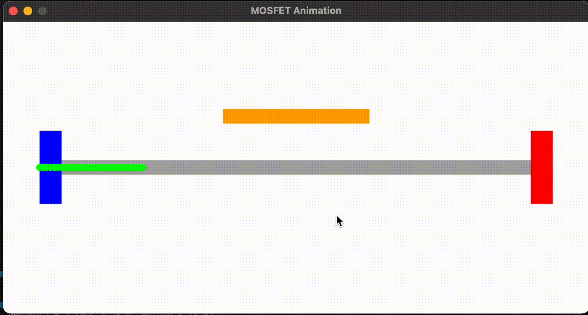
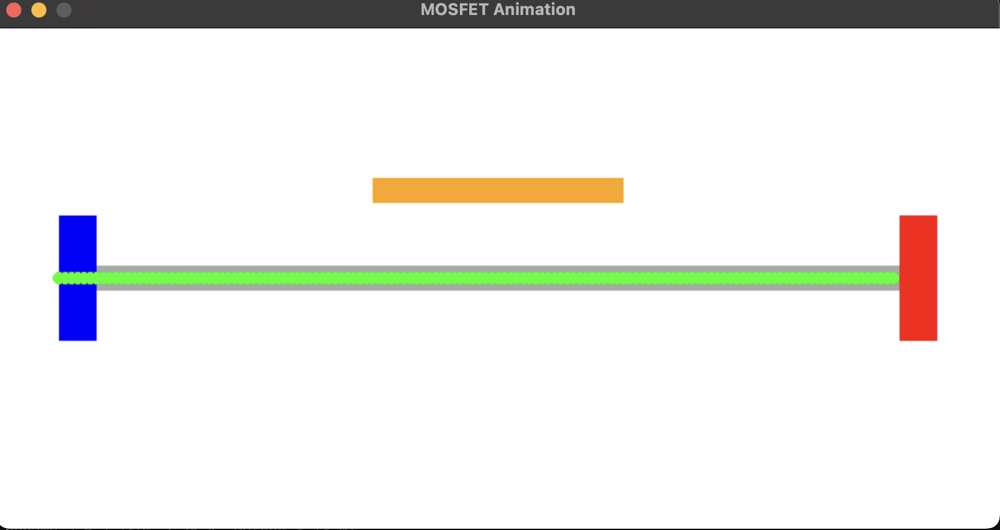

# MOSFET Animtation 

# Code

```bash
import pygame
import sys

pygame.init()

screen = pygame.display.set_mode((800, 400))
pygame.display.set_caption("MOSFET Animation")

WHITE = (255, 255, 255)
BLUE = (0, 0, 255)
RED = (255, 0, 0)
GREEN = (0, 255, 0)
GREY = (169, 169, 169)
ORANGE = (255, 165, 0)

electron_positions = [50]  
gate_active = False

clock = pygame.time.Clock()

while True:
    for event in pygame.event.get():
        if event.type == pygame.QUIT:
            pygame.quit()
            sys.exit()
        if event.type == pygame.KEYDOWN:
            if event.key == pygame.K_SPACE:  
                gate_active = not gate_active
                if not gate_active:  
                    electron_positions = [50]

    screen.fill(WHITE)

    pygame.draw.rect(screen, BLUE, (50, 150, 30, 100))  
    pygame.draw.rect(screen, RED, (720, 150, 30, 100))
    pygame.draw.rect(screen, GREY, (80, 190, 640, 20))

    gate_color = ORANGE if gate_active else GREY
    pygame.draw.rect(screen, gate_color, (300, 120, 200, 20))  

    if gate_active:
        new_position = electron_positions[-1] + 5
        electron_positions.append(new_position)
        

        electron_positions[:] = [pos for pos in electron_positions if pos < 720]

    
    for pos in electron_positions:
        pygame.draw.circle(screen, GREEN, (int(pos), 200), 5)

    pygame.display.flip()
    clock.tick(30)

```

# Working




# Output


